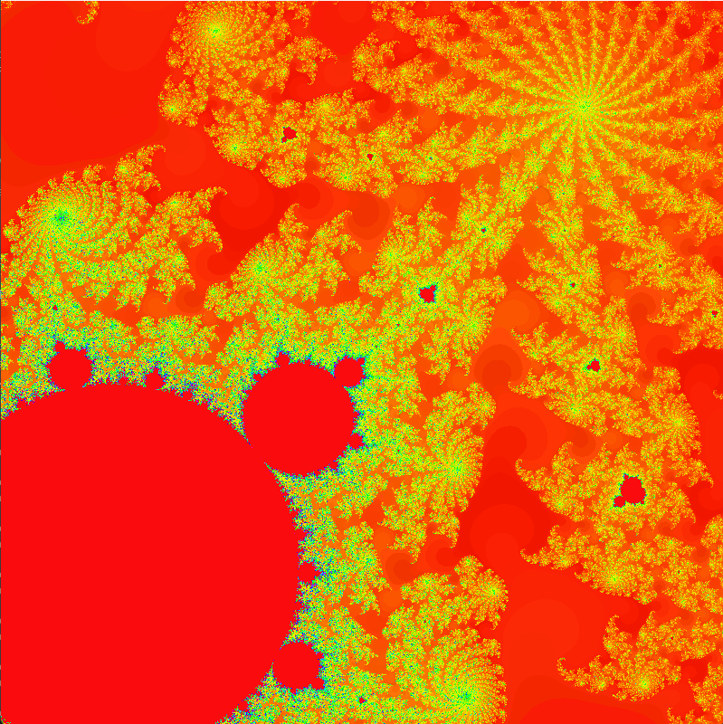

# Mandelbrot
 Mandelbrot set visualization with different textures 

 

How to controll the program: 
-Up and Down arrow: Incrase and decrease the number of maximum iterations. 
-Keys 1 to 5: Change the texture  
-Space: Show and hide the information bar at the bottom  
-Left mouse click: Zoom into the mandelbrot set at the clicked coordinates 

Required libraries:
  pygame, 
  numpy, 
  numba, 
